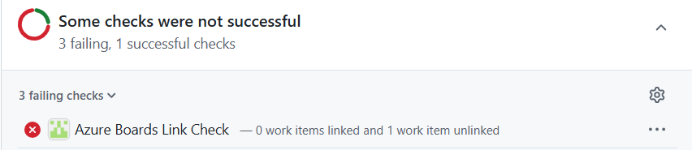
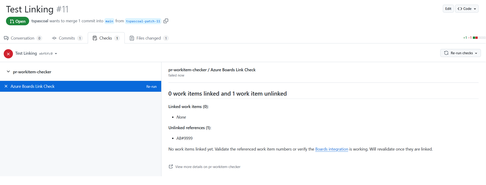
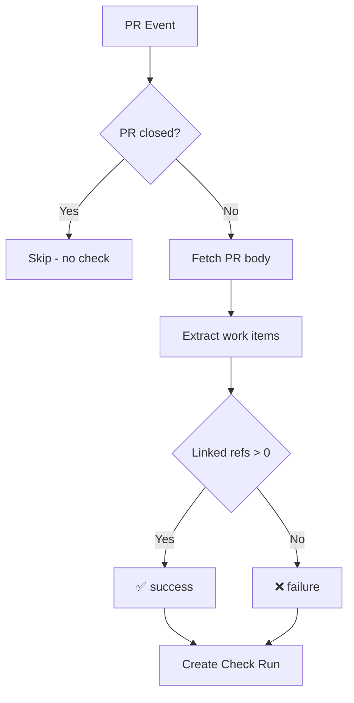

# pr-workitem-checker-app

> A [Probot](https://probot.github.io/) GitHub App that validates pull requests reference [Azure Boards](https://azure.microsoft.com/products/devops/boards/) work items in the pull request body.

> [!NOTE]  
> **Proof of Concept** — This project is a proof of concept and is not production-ready. For production use at scale, consider migrating to a queue-based architecture with asynchronous event handling to ensure reliability, scalability, and proper error recovery. Additional features such as rate limiting, retries, and observability would also be needed.

## Purpose

Enforce that every PR includes proper Azure Boards work item linkage in the PR body. The app creates a **GitHub Check Run** that reports whether work items are linked, helping maintain traceability between code changes and work items.

Make it a required check to block merges of PRs that lack proper work item references.



The name of the check is `Azure Boards Link Check`.

## Features

### Work Item Detection
The app scans PR bodies for Azure Boards references in two formats:

| Format | Example | Status |
|--------|---------|--------|
| **Linked** | `[AB#123](https://dev.azure.com/org/project/_workitems/edit/123)` | ✅ Counts toward success |
| **Unlinked** | `AB#123` | ⚠️ Warning only |

> **Note:** Linked references are automatically created when Azure Boards ↔ GitHub integration is properly configured.

### Check Run Outcomes

| Conclusion | Condition | Icon |
|------------|-----------|------|
| ✅ **success** | At least one linked work item reference (and no unlinked refs if `PASS_REQUIRES_ALL_LINKED_WORKITEMS=true`) | Green check |
| ❌ **failure** | No linked work item references, or unlinked refs exist when `PASS_REQUIRES_ALL_LINKED_WORKITEMS=true` | Red X |

### Title

The check run title reflects the actual counts:
- `1 work item linked`
- `2 work items linked and 1 work item unlinked`
- `No work items found`

### Rich Summary in check detail
The check summary includes:
- Markdown list of linked work items (clickable links)
- List of unlinked references
- Guidance on fixing issues with links to [Azure Boards integration docs](https://learn.microsoft.com/en-us/azure/devops/boards/github/?view=azure-devops)
- Tip to re-run the check after linking work items



## Events Handled

The links are checked when a pull request is created, the body is edited, new commits are pushed or a check run is re-requested.

| Event | Trigger |
|-------|---------|
| `pull_request.opened` | New PR created |
| `pull_request.edited` | PR body modified |
| `pull_request.reopened` | Closed PR reopened |
| `pull_request.synchronize` | New commits pushed |
| `check_run.rerequested` | User re-runs the check |

The Pull request body is fetched instead of using the webhook payload to ensure the latest content is validated (avoid out of order event execution issues, but still not guaranteed).

> **Closed PRs:** Validation is skipped—no check run is created.

## Project Structure

```
/
├── index.js                 # Probot entry point & event handlers
├── helpers/
│   └── validatePullRequest.js  # Core validation logic
├── test/
│   ├── index.test.js        # Test suite
│   └── fixtures/            # Test payloads
├── app.yml                  # GitHub App manifest
├── Dockerfile               # Container build
└── package.json
```

## Requirements

- **Node.js** >= 18
- A registered [GitHub App](https://docs.github.com/en/apps/creating-github-apps)

### GitHub App Permissions

| Permission | Access | Purpose |
|------------|--------|---------|
| **Checks** | Write | Create/update check runs |
| **Pull requests** | Read | Fetch PR body |
| **Metadata** | Read | Repository info |

### Subscribed Events

- `check_run`
- `check_suite`
- `pull_request`

## Environment Variables

| Variable | Required | Default | Description |
|----------|----------|---------|-------------|
| `APP_ID` | ✅ | | GitHub App ID |
| `PRIVATE_KEY` | ✅ | | PEM contents of private key |
| `WEBHOOK_SECRET` | ✅ | | GitHub App webhook secret |
| `GHE_HOST` | ❌ | | GitHub Enterprise hostname (if not using github.com) |
| `LOG_LEVEL` | ❌ | `warn` | Logging verbosity (`debug`, `info`, `warn`, `error`) |
| `PROCESS_PR_OPENED` | ❌ | `false` | Handle `pull_request.opened` events. Set to `true` to validate PRs when first created. |
| `ALWAYS_FETCH_PR` | ❌ | `true` | Always fetch PR body from GitHub. Set to `false` to use the body from the webhook payload (reduces API calls). |
| `PASS_REQUIRES_ALL_LINKED_WORKITEMS` | ❌ | `false` | Require all work items to be linked. Set to `true` to fail the check if any unlinked references exist. |
| `IGNORE_COPILOT` | ❌ | `true` | Ignore events triggered by Copilot (when `sender.login === 'copilot'`). Set to `false` to process Copilot-triggered events. Note: `pull_request.synchronize` events are always processed regardless of this setting. |

> **Notes:**
> - By default, `pull_request.opened` events are ignored. This is useful when using other tools (e.g., PR templates) that modify the PR body immediately after creation, which would trigger a `pull_request.edited` event anyway.
> - When `ALWAYS_FETCH_PR=false`, the PR body from the webhook payload is used for `pull_request.*` events. The API is still used for `check_run.rerequested` events since the body isn't in that payload.

## Quick Start

```bash
# Install dependencies
npm install

# Start the app (uses probot run)
npm start
```

## Testing

```bash
# Run tests (uses Node.js built-in test runner)
npm test

# Syntax check
npm run lint
```

The test suite uses [nock](https://github.com/nock/nock) to mock GitHub API responses.

## Docker

```bash
# Build the image
docker build -t pr-workitem-checker-app .

# Run the container
docker run \
  -e APP_ID=<app-id> \
  -e PRIVATE_KEY="$(cat private-key.pem)" \
  -e WEBHOOK_SECRET=<secret> \
  -p 3000:3000 \
  pr-workitem-checker-app
```

## Local Development

### Webhook Forwarding
Uses [smee.io](https://smee.io) to forward webhooks to your local machine:

```bash
npx smee -u https://smee.io/YOUR_CHANNEL -t http://localhost:3000/api/github/webhooks
```

### Re-running Checks

After linking work items in Azure Boards, navigate to the **Checks** tab on the PR and click **Re-run** to refresh the validation (only for failed checks).

### Structured Logging

The app uses Probot's built-in logger (`context.log`) with structured output:

```javascript
context.log.info({ pull_number, owner, repo }, "Handling pull request event");
```

## How It Works



## Potential Improvements

- Allow users to trigger re-validation via comments (slash comment or @mention)
- Use a queue system for processing events asynchronously
- Improve observability (metrics, tracing)
- Scalability enhancements
  - Support for rate limiting and retries.
  - Cache PR bodies to reduce API calls

## Contributing

Contributions welcome! Please read [CONTRIBUTING.md](CONTRIBUTING.md).

## License

[ISC](LICENSE) © 2026 Tiago Pascoal
